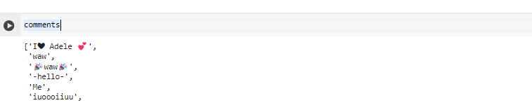
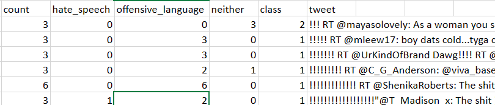
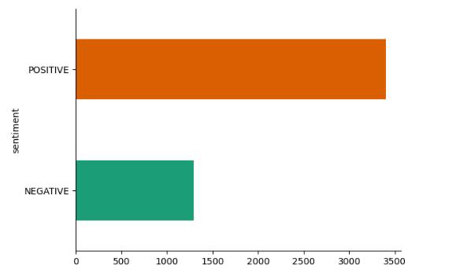
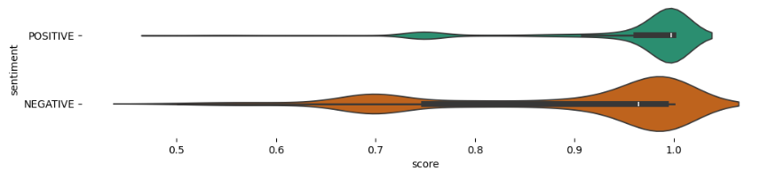
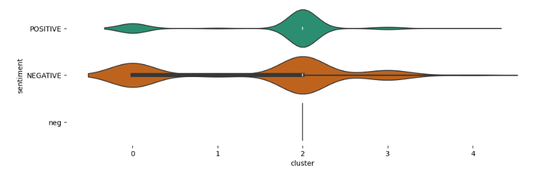
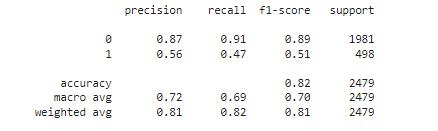
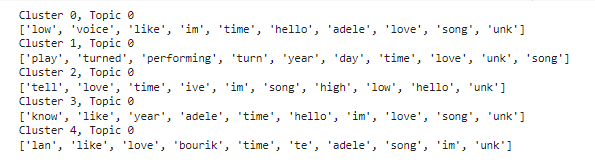
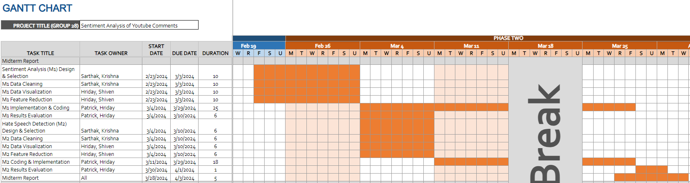

# Midterm Report
## Introduction/Background
The surge in user-generated content on online platforms, particularly YouTube, has brought forth a rise in hate speech and negativity. Our proposal focuses on sentiment analysis of YouTube comments, aiming to mitigate harmful content and gain insights into user opinions for a healthier online environment.

Data collection [[7]](#7)[[9]](#9) involves API usage following guidance from a relevant [Medium post](https://medium.com/@sinabaghaee96/data-extraction-from-youtube-api-ceae7d988899). Pre-processing, utilizing techniques like tokenization, stopword removal, lemmatization, and stemming [[8]](#8), is vital for effective Natural Language Processing. Past research on sentiment analysis includes methodologies such as SVMs, Transfer Learning, and Transformer architectures [[4]](#4)[[5]](#5)[[6]](#6), with specific insights from works focused on YouTube comments [[1]](#1)[[2]](#2)[[3]](#3) serving as inspiration for our proposed pipeline.
   

## Problem Definition
The primary objective of sentiment analysis on YouTube comments is to classify the sentiment expressed in user-generated text into predefined categories such as positive, negative, neutral, or hateful. The foremost challenge lies in developing robust sentiment analysis models capable of discerning positive and negative tones alongside identifying potentially harmful or toxic language within YouTube comments.  

## Methods

Two types of datasets were used: 

1. One consists of YouTube comments extracted using the YouTube Data API. 5000 comments from Adele’s Hello video were used for the analysis below. The data once extracted and appended into a list looked like this:

2. The second dataset is a labeled Twitter hate speech dataset from Kaggle with fields as below:

Our pipeline encompasses several stages: data collection and preprocessing, sentiment analysis, hate speech detection, and clustering for insights into the comments' underlying themes.

### Data Preprocessing
The preprocessing step is a crucial step to ensure the quality and consistency of the input for subsequent analysis. The preprocessing pipeline implements the following procedures:
1. **Cleaning**: Comments are converted to lowercase to standardize the text. Non-alphanumeric characters, including URLs, user mentions, hashtags, and HTML tags, are removed to reduce noise.
2. **Tokenization**: The cleaned text is tokenized, splitting each comment into individual words or tokens which helps us to break text into analyzable pieces.
3. **Stopword Removal**: Common words that offer minimal value in understanding sentiment or hate speech, such as "and", "is", "in", etc., are removed.
Translation: For comments not in English, automated translation to English is performed to standardize the analysis, accommodating the primarily English-language models used for sentiment analysis and hate speech detection.

### ML Algorithms/Models
1. **Sentiment Analysis**: Sentiment analysis is conducted using a pre-trained BERT model from the Hugging Face `transformers` library, which classifies each comment into positive or negative sentiment. Due to BERT's input limitation of 512 tokens, longer comments are truncated. This model choice is predicated on BERT's proven effectiveness across various NLP tasks, which offer a deep understanding of language context and sentiment.
2. **Hate Speech Detection**: Hate speech detection is similarly approached with a BERT-based model, fine-tuned on a dataset labeled for hate speech to discern harmful content within the comments. The labeled dataset however was available from twitter data, but since that is also textual data from a social media, we assumed that it would translate well to YouTube comments. This step is crucial for identifying and addressing negative or dangerous speech patterns in the dataset.
3. **Language Translation**: Comments detected in languages other than English are translated using Google's Translation API. This process ensures that the sentiment analysis and hate speech detection models, which are optimized for English text, can be applied uniformly across the dataset.
4. **Text Embedding and Dimensionality Reduction**: The preprocessed text data is transformed into numerical representations using an autoencoder, a type of neural network that learns a compressed, dense representation of the data. The autoencoder is designed with an embedding dimension of 32, aiming to capture the essential features of the text within a lower-dimensional space. This process facilitates efficient clustering and analysis by reducing the complexity of the data. 

*Autoencoder Configuration: The autoencoder compresses text data into a 32-dimensional embedding space and is trained over 50 epochs with a batch size of 256*

5. **Clustering with K-Means (Unsupervised)**:The embedded comments are clustered using the K-Means algorithm, which partitions the data into five distinct groups based on the similarity of their embeddings. This step aims to identify underlying themes or categories within the comments, with each cluster potentially representing a different sentiment, topic, or type of feedback.
   1. *Cluster Analysis*- For each cluster, representative comments closest to the cluster's centroid are identified, providing insight into the thematic content of each group.
   2. *Topic Modeling and Word Frequency Analysis*-Within each cluster, two analyses are conducted to explore the prevalent themes and vocabulary:
      1. Word Frequency Analysis: A Count Vectorizer identifies the most frequent words in each cluster, excluding common English stopwords. This analysis reveals the dominant terms and subjects discussed within each cluster.
      2. Topic Modeling: Latent Dirichlet Allocation (LDA) is applied to comments within each cluster to identify prominent topics. LDA, configured to extract a single topic per cluster, offers a more abstract understanding of the text data, encapsulating the key themes discussed by commenters.

*Implementation Details: The methods are implemented in Python, utilizing libraries such as `pandas` for data manipulation, `transformers` and `torch` for NLP and deep learning models, and `matplotlib` and `seaborn` for visualization. Data cleaning and preprocessing leverage regular expressions and the `nltk` library.*

## Results and Discussions
### Visualizations
Post-applying sentiment analysis to our data using pre-trained BERT model we saw the following split for positive and negative comments:

Violin plot comparing the distribution of sentiment analysis scores for positive and negative sentiments shows that scores for positive sentiments tend to cluster towards higher values, closer to 1, indicating stronger confidence in positive classification. In contrast, scores for negative sentiments are spread out more evenly, suggesting varying levels of confidence in negative classifications.

The violin plot for K-means shows five distinct sentiment clusters, with clusters 0 and 4 exhibiting a wider distribution skewed towards negative sentiment, while cluster 2 is more positively skewed, and clusters 1 and 3 show narrower distributions centered around neutral to slightly negative sentiments

### Qunatitative Metrics
Our approach had a sentiment analysis part and also a hate speech training part from labelled twitter data. As for the sentiment analysis part, the BERT model used was the pre-trained hugging face model and hence only basic validity checks were done like checking random samples and overall distributions of sentiments. 

As for the hate speech part, we saw precision, recall and F1-score, it indicates that the model is highly accurate at identifying 'no hate speech' (class 0) with high precision and recall, but it struggles to correctly identify 'hate speech' (class 1), as reflected by the lower precision and recall values. Despite this, the overall model accuracy is at 0.82.

### Analysis of 1+ Algorithm/Model
With K-mean we tried to see, the most frequent terms used within each sentiment cluster, aside from the most common English words. This can give insights into the themes or topics that are prevalent within each cluster, potentially revealing what drives the sentiment in each group.

From applying Latent Dirichlet Allocation (LDA) for topic modeling to comments within clusters identified by a k-means algorithm. For each cluster, the LDA model identifies the most relevant words that constitute a single topic. Common words like 'time', 'hello', 'love', 'song', and 'Adele' appear across different clusters, suggesting they are key to the underlying topics.

### Next Steps
1. Issues with country in hate speech tagging: The BERT model is incorrectly tagging all comments that reference a country (for example, "Any Brazilians here?") as hate speech. We are working to refine this in the coming weeks.
2. Clustering: We attempted to use K-means clustering to discern clear thematic patterns in the comments but were unable to identify any distinct themes. We plan to explore additional clustering techniques to determine if there are any common themes present.
3. Add Others: Look at the possibility of an 'others' cluster where the patterns are not very apparent
   
## References
1.	<a name="1">Alhujaili, Rawan Fahad, and Wael MS Yafooz. "Sentiment analysis for youtube videos with user comments." 2021 International Conference on Artificial Intelligence and Smart Systems (ICAIS). IEEE, 2021.</a>
2.	<a name="2">Sivanantham, Kalimuthu, et al. "Cybercrime Sentimental Analysis for Child Youtube Video Dataset Using Hybrid Support Vector Machine with Ant Colony Optimization Algorithm." Kids Cybersecurity Using Computational Intelligence Techniques. Cham: Springer International Publishing, 2023. 175-193.</a>
3.	<a name="3">Santhiya, S., P. Jayadharshini, and S. V. Kogilavani. "Transfer Learning Based Youtube Toxic Comments Identification." International Conference on Speech and Language Technologies for Low-resource Languages. Cham: Springer International Publishing, 2022.</a>
4.	<a name="4">Jahan, Md Saroar, and Mourad Oussalah. "A systematic review of Hate Speech automatic detection using Natural Language Processing." Neurocomputing (2023): 126232.</a>
5.	<a name="5">Saleh, Hind, Areej Alhothali, and Kawthar Moria. "Detection of hate speech using BERT and hate speech word embedding with deep model." Applied Artificial Intelligence 37.1 (2023): 2166719.</a>
6.	<a name="6">Ava, Lamima Tabassum, et al. "Intelligent Identification of Hate Speeches to address the increased rate of Individual Mental Degeneration." Procedia Computer Science 219 (2023): 1527-1537.</a>
7.	<a name="7">V. Krotov and L. Silva. “The Use of APIs for Data Collection on the Internet”. In: The Review of Business Information Systems (RBIS) 20.1 (2016), pp. 49–56.</a>
8.	<a name="8">Tabassum, A. and Patil, R.R., 2020. A survey on text pre-processing & feature extraction techniques in natural language processing. International Research Journal of Engineering and Technology, 7(6), pp.4864-4867.</a>
9.	<a name="9">Daniel Glez-Pena et al. “Web scraping technologies in an API world”. In: BRIEFINGS IN BIOINFORMATICS 58.5 (2015), pp. 62–71.</a>

## Gantt Chart
The following image highlights the timeline and key contirbutions of all team members in the midterm report (Phase 2):

The proposed timeline (Gantt Chart) for the entire project can be found at this [link.](https://gtvault-my.sharepoint.com/:x:/g/personal/skhare30_gatech_edu/Ea-sehTwc_BBkgbV9ztxF5wBv81AA7pGV605hTfap0Wk4Q?e=MGCnyw)

## Contributions

| **Member Name**           | **Contributions**                                                           |   
|---------------------------|--------------------------------------------------------------------------------------|
| Hriday Harlalka           | Data Visualization, Feature Reduction, Implementation and Coding, Results Evaluation |
| Krishna Raj               | Website, Model Design and Selection, Data Cleaning                                     |
| Patrick Copeland          | Implementation and Coding, Results Evaluation                                        |
| Sarthak Khare             | Website, Model Design and Selection, Data Cleaning                                     |
| Shiven Barbare            | Website, Data Visualization, Feature Reduction                                        |

[back](index.md)
