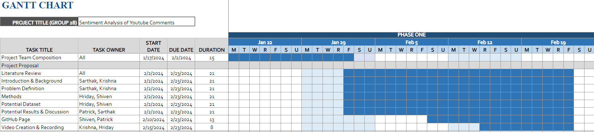

# Project Proposal
## Introduction/Background
The surge in user-generated content on online platforms, particularly YouTube, has brought forth a rise in hate speech and negativity. Our proposal focuses on sentiment analysis of YouTube comments, aiming to mitigate harmful content and gain insights into user opinions for a healthier online environment.

Data collection [[7]](#7)[[9]](#9) involves API usage following guidance from a relevant [Medium post](https://medium.com/@sinabaghaee96/data-extraction-from-youtube-api-ceae7d988899). Pre-processing, utilizing techniques like tokenization, stopword removal, lemmatization, and stemming [[8]](#8), is vital for effective Natural Language Processing. Past research on sentiment analysis includes methodologies such as SVMs, Transfer Learning, and Transformer architectures [[4]](#4)[[5]](#5)[[6]](#6), with specific insights from works focused on YouTube comments [[1]](#1)[[2]](#2)[[3]](#3) serving as inspiration for our proposed pipeline. 

## Problem Definition
The primary objective of sentiment analysis on YouTube comments is to classify the sentiment expressed in user-generated text into predefined categories such as positive, negative, neutral, or hateful. The foremost challenge lies in developing robust sentiment analysis models capable of discerning positive and negative tones alongside identifying potentially harmful or toxic language within YouTube comments.  

## Methods

### Data Preprocessing
We plan to preprocess our data in 3 steps: 

1.  **Text cleaning and tokenization**: This method involves removing irrelevant characters, symbols, and HTML tags from the comments. Subsequently, the text is tokenized into individual words, which facilitates feature extraction and analysis. 

2.  **Stopword deletion**: Stopwords are common words that do not carry significant meaning for sentiment analysis. Removing them helps reduce noise within the comments. 

3.  **Lemmatization and stemming:** This aims to normalize words to their base form. This reduces dimensionality and captures the core meaning of words, improving the performance of models. 

### Machine Learning Methods
1.  **Recurrent Neural Networks**: RNNs, specifically long short-term memory (LSTM) variants, are effective for capturing sequential dependencies in text data, which is crucial for sentiment analysis. 

2.  **Support Vector Machines**: SVMs are well-suited for binary classification tasks like sentiment analysis. Since we propose classifying our data into more than two categories, we explore the use of multiclass classification. 

3.  **Transformer Models**: Transformer models, like BERT, have shown state-of-the-art performance in various NLP tasks. Their attention mechanisms allow them to capture contextual information, making them suitable for sentiment analysis. 

## Results and Discussions
We propose a number of metrics for assessing the results of our models, which we will refine as we make progress. 

1.  **Hate Speech Detection Accuracy**: Evaluating the accuracy of the model in identifying hate speech or harmful content within YouTube comments. 

2.  **Toxicity Prediction Precision and Recall**: Measuring the precision and recall of the model in identifying toxic language, balancing the trade-off between false positives and false negatives. 

3.  **Emotion Recognition F1 Score**: Assessing the model’s ability to accurately recognize and classify emotions. 

4.  **User Engagement Metrics**: Exploring user engagement metrics, such as likes, dislikes, and comment replies, to gauge the impact of sentiment on community interaction. 

The goal is to have high values of precision/recall, accuracy and F1 score for our model, aiming to achieve an F1 score of **0.5-0.8** and accuracy of **70-80%**.

## References
1.	<a name="1">Alhujaili, Rawan Fahad, and Wael MS Yafooz. "Sentiment analysis for youtube videos with user comments." 2021 International Conference on Artificial Intelligence and Smart Systems (ICAIS). IEEE, 2021.</a>
2.	<a name="2">Sivanantham, Kalimuthu, et al. "Cybercrime Sentimental Analysis for Child Youtube Video Dataset Using Hybrid Support Vector Machine with Ant Colony Optimization Algorithm." Kids Cybersecurity Using Computational Intelligence Techniques. Cham: Springer International Publishing, 2023. 175-193.</a>
3.	<a name="3">Santhiya, S., P. Jayadharshini, and S. V. Kogilavani. "Transfer Learning Based Youtube Toxic Comments Identification." International Conference on Speech and Language Technologies for Low-resource Languages. Cham: Springer International Publishing, 2022.</a>
4.	<a name="4">Jahan, Md Saroar, and Mourad Oussalah. "A systematic review of Hate Speech automatic detection using Natural Language Processing." Neurocomputing (2023): 126232.</a>
5.	<a name="5">Saleh, Hind, Areej Alhothali, and Kawthar Moria. "Detection of hate speech using BERT and hate speech word embedding with deep model." Applied Artificial Intelligence 37.1 (2023): 2166719.</a>
6.	<a name="6">Ava, Lamima Tabassum, et al. "Intelligent Identification of Hate Speeches to address the increased rate of Individual Mental Degeneration." Procedia Computer Science 219 (2023): 1527-1537.</a>
7.	<a name="7">V. Krotov and L. Silva. “The Use of APIs for Data Collection on the Internet”. In: The Review of Business Information Systems (RBIS) 20.1 (2016), pp. 49–56.</a>
8.	<a name="8">Tabassum, A. and Patil, R.R., 2020. A survey on text pre-processing & feature extraction techniques in natural language processing. International Research Journal of Engineering and Technology, 7(6), pp.4864-4867.</a>
9.	<a name="9">Daniel Glez-Pena et al. “Web scraping technologies in an API world”. In: BRIEFINGS IN BIOINFORMATICS 58.5 (2015), pp. 62–71.</a>

## Gantt Chart
The following image highlights the timeline and key contirbutions of all team members in the proposal (Phase 1):

The proposed timeline (Gantt Chart) for the entire project can be found at this [link.](https://gtvault-my.sharepoint.com/:x:/g/personal/skhare30_gatech_edu/Ea-sehTwc_BBkgbV9ztxF5wBv81AA7pGV605hTfap0Wk4Q?e=MGCnyw)
## Contributions

| **Member Name**              | **Proposal Contributions**                               |   
|---------------------------|-------------------------------------------------------|
| Hriday Harlalka           | Literature Review, Methods, Dataset, Proposal Video                   |
| Krishna Raj               | Proposal Video, Literature Review, Background         |
| Patrick Copeland          | Website, Literature Review, Results        |
| Sarthak Khare             | Literature Review, Background, Methods, Results               |
| Shiven Barbare            | Website, Literature Review, Methods, Dataset    |

[back](index.md)
